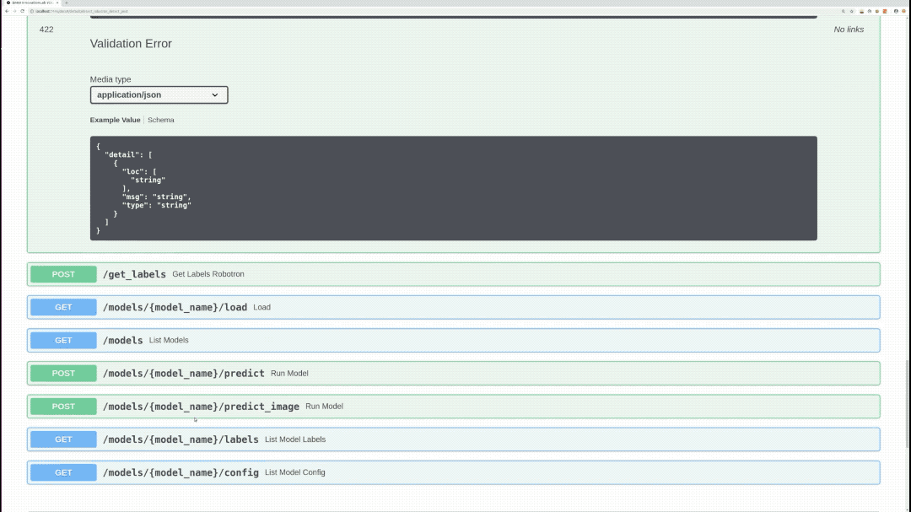
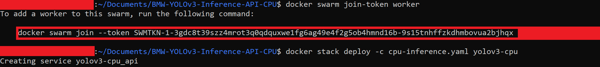
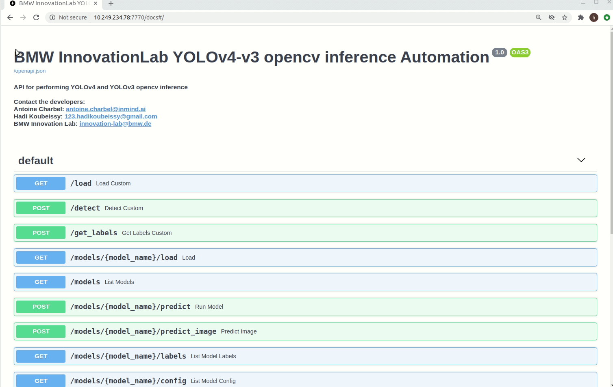
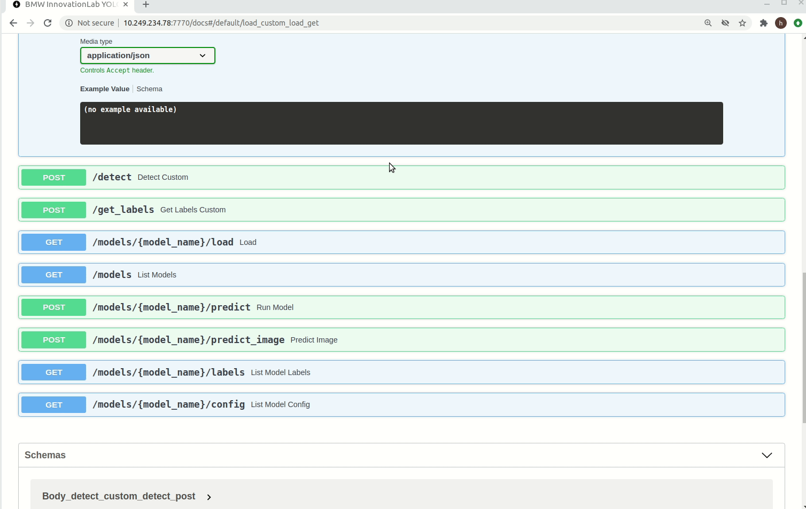
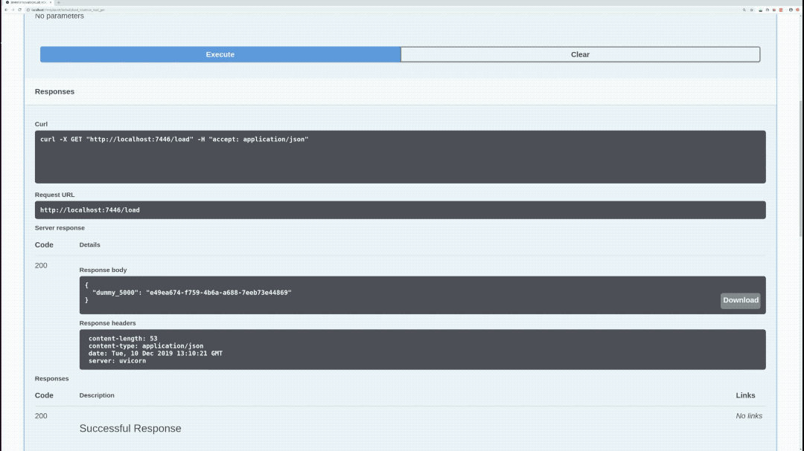
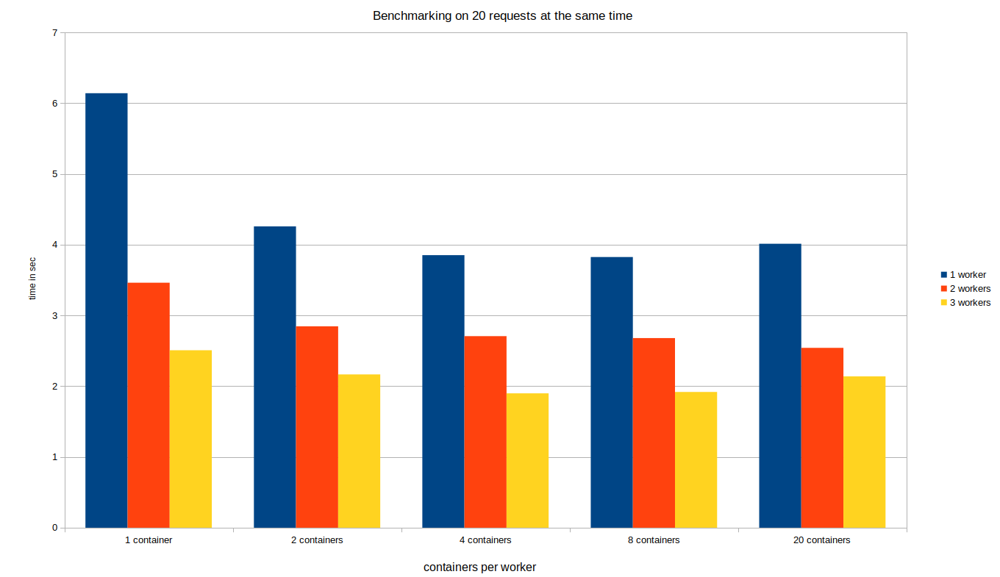
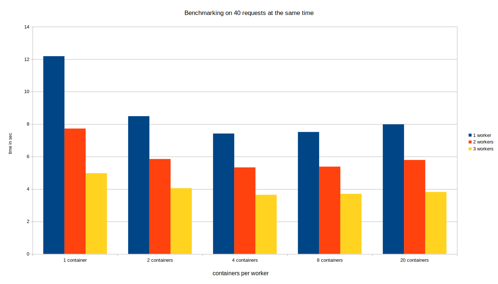

# YOLO v3 CPU Inference API for Windows and Linux

This is a repository for an object detection inference API using the Yolov3 Opencv.

The inference REST API works on CPU and doesn't require any GPU usage. It's supported on both Windows and Linux Operating systems.

Models trained using our training Yolov3 repository can be deployed in this API. Several object detection models can be loaded and used at the same time.

This repo can be deployed using either **docker** or **docker swarm**.

Please use **docker swarm** only if you need to:

* Provide redundancy in terms of API containers: In case a container went down, the incoming requests will be redirected to another running instance.

* Coordinate between the containers: Swarm will orchestrate between the APIs and choose one of them to listen to the incoming request.

* Scale up the Inference service in order to get a faster prediction especially if there's traffic on the service.

If none of the aforementioned requirements are needed, simply use **docker**.



## Contents

```sh
YOLO v3 CPU Inference API for Windows and Linux/
├── Prerequisites
│   ├── Check for prerequisites
│   └── Install prerequisites
├── Build The Docker Image
├── Run the docker container
│   ├── Docker
│   └── Docker swarm
│       ├── Docker swarm setup
│       ├── With one host
│       ├── With multiple hosts
│       └── Useful Commands
├── API Endpoints
├── Model structure
└── Benchmarking
    ├── Docker
    └── Docker swarm
```

## Prerequisites

- OS:
  - Ubuntu 16.04/18.04
  - Windows 10 pro/enterprise
- Docker

### Check for prerequisites

To check if you have docker-ce installed:

```sh
docker --version
```

### Install prerequisites

#### Ubuntu

Use the following command to install docker on Ubuntu:

```sh
chmod +x install_prerequisites.sh && source install_prerequisites.sh
```

#### Windows 10

To [install Docker on Windows](https://docs.docker.com/docker-for-windows/install/), please follow the link.

**P.S: For Windows users, open the Docker Desktop menu by clicking the Docker Icon in the Notifications area. Select Settings, and then Advanced tab to adjust the resources available to Docker Engine.**

## Build The Docker Image

In order to build the project run the following command from the project's root directory:

```sh
sudo docker build -t yolov3_inference_api_cpu -f ./docker/dockerfile .
```
### Behind a proxy

```sh
sudo docker build --build-arg http_proxy='' --build-arg https_proxy='' -t yolov3_inference_api_cpu -f ./docker/dockerfile .

```

## Run The Docker Container

### Docker

To run the API, go the to the API's directory and run the following:

#### Using Linux based docker:

```sh
sudo docker run -itv $(pwd)/models:/models -p <docker_host_port>:7770 yolov3_inference_api_cpu
```
#### Using Windows based docker:

```sh
docker run -itv ${PWD}/models:/models -p <docker_host_port>:7770 yolov3_inference_api_cpu
```

The <docker_host_port> can be any unique port of your choice.

The API file will be run automatically, and the service will listen to http requests on the chosen port.


In case you are deploying your API without **docker swarm**, please skip the next section and directly proceed to *API endpoints section*.

### Docker swarm

Docker swarm can scale up the API into multiple replicas and can be used on one or multiple hosts(Linux users only). In both cases, a docker swarm setup is required for all hosts.

#### Docker swarm setup

1- Initialize Swarm:

```sh 
docker swarm init
```

2- On the manager host, open the cpu-inference.yaml file and specify the number of replicas needed. In case you are using multiple hosts (With multiple hosts section), the number of replicas will be divided across all hosts.

```yaml
version: "3"

services:
  api:
    ports:
      - "7770:7770"
    image: yolov3_inference_api_cpu
    volumes:
      - "/mnt/models:/models"
    deploy:
      replicas: 1
      update_config:
        parallelism: 2
        delay: 10s
      restart_policy:
        condition: on-failure
```

**Notes about cpu-inference.yaml:**

* the volumes field on the left of ":" should be an absolute path, can be changeable by the user, and represents the models directory on your Operating System
* the following volume's field ":/models" should never be changed

#### With one host

Deploy the API:

```sh
docker stack deploy -c cpu-inference.yaml yolov3-cpu
```


#### With multiple hosts (Linux users only)

1- **Make sure hosts are reachable on the same network**. 

2- Choose a host to be the manager and run the following command on the chosen host to generate a token so the other hosts can join:

```sh
docker swarm join-token worker
```

A command will appear on your terminal, copy and paste it on the other hosts, as seen in the below image

3- Deploy your application using:

```sh 
docker stack deploy -c cpu-inference.yaml yolov3-cpu
```



#### Useful Commands

1- In order to scale up the service to 4 replicas for example use this command:

```sh
docker service scale yolov3-cpu_api=4
```

2- To check the available workers:

```sh
docker node ls
```

3- To check on which node the container is running:

```sh
docker service ps yolov3-cpu_api
```

4- To check the number of replicas:

```sh
docker service ls
```

## API Endpoints

To see all available endpoints, open your favorite browser and navigate to:

```
http://<machine_IP>:<docker_host_port>/docs
```
The 'predict_batch' endpoint is not shown on swagger. The list of files input is not yet supported.

**P.S: If you are using custom endpoints like /load, /detect, and /get_labels, you should always use the /load endpoint first and then use /detect or /get_labels**

### Endpoints summary

#### /load (GET)

Loads all available models and returns every model with it's hashed value. Loaded models are stored and aren't loaded again



#### /detect (POST)

Performs inference on specified model, image, and returns bounding-boxes



#### /get_labels (POST)

Returns all of the specified model labels with their hashed values



#### /models/{model_name}/predict_image (POST)

Performs inference on specified model, image, draws bounding boxes on the image, and returns the actual image as response


#### /models (GET)

Lists all available models

#### /models/{model_name}/load (GET)

Loads the specified model. Loaded models are stored and aren't loaded again

#### /models/{model_name}/predict (POST)

Performs inference on specified model, image, and returns bounding boxes.

#### /models/{model_name}/labels (GET)

Returns all of the specified model labels

#### /models/{model_name}/config (GET)

Returns the specified model's configuration

#### /models/{model_name}/predict_batch (POST)

Performs inference on specified model and a list of images, and returns bounding boxes

**P.S: Custom endpoints like /load, /detect, and /get_labels should be used in a chronological order. First you have to call /load, and then call /detect or /get_labels**

## Model structure

The folder "models" contains subfolders of all the models to be loaded.
Inside each subfolder there should be a:

- Cfg file (yolo-obj.cfg): contains the configuration of the model

- Weights file (yolo-obj.weights)

- Names file  (obj.names) : contains the names of the classes

- Config.json (This is a json file containing information about the model)

  ```json
    {
      "inference_engine_name": "yolov3_opencv_cpu_detection",
      "confidence": 60,
      "nms_threshold": 0.6,
      "image": {
        "width": 416,
        "height": 416,
        "scale": 0.00392,
        "swapRB": true,
        "crop": false,
        "mean": {
          "R": 0,
          "G": 0,
          "B": 0
        }
      },
      "framework": "yolo",
      "type": "detection",
      "network": "network_name"
    }
  ```
  P.S
  - You can change confidence and nms_threshold values while running the API
  - The API will return bounding boxes with a confidence higher than the "confidence" value. A high "confidence" can show you only accurate predictions

## Benchmarking

### Docker

<table>
    <thead align="center">
        <tr>
            <th></th>
            <th>Windows</th>
            <th colspan=3>Ubuntu</th>
        </tr>
    </thead>
    <thead align="center">
        <tr>
            <th>Network\Hardware</th>
            <th>Intel Xeon CPU 2.3 GHz</th>
            <th>Intel Xeon CPU 2.3 GHz</th>
            <th>Intel Core i9-7900 3.3 GHZ</th>
            <th>GeForce GTX 1080</th>
        </tr>
    </thead>
    <tbody align="center">
        <tr>
            <td>pascalvoc_dataset</td>
            <td>0.885 seconds/image</td>
            <td>0.793 seconds/image</td>
            <td>0.295 seconds/image</td>
            <td>0.0592 seconds/image</td>
        </tr>
    </tbody>
</table>

### Docker swarm

Here are two graphs showing time of prediction for different number of requests at the same time.








We can see that both graphs got the same result no matter what is the number of received requests at the same time. When we increase the number of workers (hosts) we are able to speed up the inference by at least 2 times. For example we can see in the last column we were able to process 40 requests in:

- 8 seconds with 20 replicas in 1 machine
- 5.8 seconds with 20 replicas in each of the 2 machines
- 3.9 seconds with 20 replicas in each of the 3 machines

Moreover, in case one of the machines is down the others are always ready to receive requests.

Finally since we are predicting on CPU scaling more replicas doesn't mean a faster prediction, 4 containers was faster than 20.

## Acknowledgment

[inmind.ai](https://inmind.ai)

[robotron.de](https://robotron.de)

Antoine Charbel, inmind.ai , Beirut, Lebanon

Daniel Anani, inmind.ai, Beirut, Lebanon
