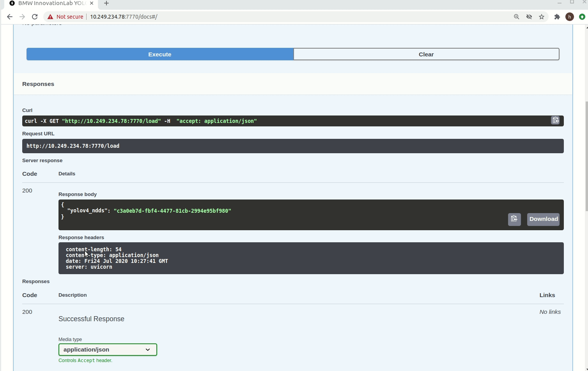

# YOLO v3 CPU Inference API for Windows and Linux

This is a repository for an object detection inference API using the Yolov3 Opencv.

The inference REST API works on CPU and doesn't require any GPU usage. It's supported on both Windows and Linux Operating systems.

Models trained using our training Yolov3 repository can be deployed in this API. Several object detection models can be loaded and used at the same time.

This repo can be deployed using either **docker** or **docker swarm**.

Please use **docker swarm** only if you need to:

* Provide redundancy in terms of API containers: In case a container went down, the incoming requests will be redirected to another running instance.

* Coordinate between the containers: Swarm will orchestrate between the APIs and choose one of them to listen to the incoming request.

* Scale up the Inference service in order to get a faster prediction especially if there's traffic on the service.

If none of the aforementioned requirements are needed, simply use **docker**.


## Prerequisites

- OS:
  - Ubuntu 16.04/18.04
  - Windows 10 pro/enterprise
- Docker

### Check for prerequisites

To check if you have docker-ce installed:

```sh
docker --version
```

### Install prerequisites

#### Ubuntu

Use the following command to install docker on Ubuntu:

```sh
chmod +x install_prerequisites.sh && source install_prerequisites.sh
```

#### Windows 10

To [install Docker on Windows](https://docs.docker.com/docker-for-windows/install/), please follow the link.

**P.S: For Windows users, open the Docker Desktop menu by clicking the Docker Icon in the Notifications area. Select Settings, and then Advanced tab to adjust the resources available to Docker Engine.**

## Build The Docker Image

In order to build the project run the following command from the project's root directory:

```sh
sudo docker build -t yolov3_inference_api_cpu -f ./docker/dockerfile .
```
### Behind a proxy

```sh
sudo docker build --build-arg http_proxy='' --build-arg https_proxy='' -t yolov3_inference_api_cpu -f ./docker/dockerfile .

```

## Run The Docker Container

As mentioned before, this container can be deployed using either **docker** or **docker swarm**.

If you wish to deploy this API using **docker**, please issue the following run command.

If you wish to deploy this API using **docker swarm**, please refer to following link [docker swarm documentation](./README-docker_swarm.md). After deploying the API with docker swarm, please consider returning to this documentation for further information about the API endpoints as well as the model structure sections.

To run the API, go the to the API's directory and run the following:

#### Using Linux based docker:

```sh
sudo docker run -itv $(pwd)/models:/models -p <docker_host_port>:7770 yolov3_inference_api_cpu
```
#### Using Windows based docker:

```sh
docker run -itv ${PWD}/models:/models -p <docker_host_port>:7770 yolov3_inference_api_cpu
```

The <docker_host_port> can be any unique port of your choice.

The API file will be run automatically, and the service will listen to http requests on the chosen port.

## API Endpoints

To see all available endpoints, open your favorite browser and navigate to:

```
http://<machine_IP>:<docker_host_port>/docs
```
The 'predict_batch' endpoint is not shown on swagger. The list of files input is not yet supported.

**P.S: If you are using custom endpoints like /load, /detect, and /get_labels, you should always use the /load endpoint first and then use /detect or /get_labels**

### Endpoints summary

#### /load (GET)

Loads all available models and returns every model with it's hashed value. Loaded models are stored and aren't loaded again


#### /detect (POST)

Performs inference on specified model, image, and returns bounding-boxes


#### /get_labels (POST)

Returns all of the specified model labels with their hashed values



#### /models/{model_name}/predict_image (POST)

Performs inference on specified model, image, draws bounding boxes on the image, and returns the actual image as response


#### /models (GET)

Lists all available models

#### /models/{model_name}/load (GET)

Loads the specified model. Loaded models are stored and aren't loaded again

#### /models/{model_name}/predict (POST)

Performs inference on specified model, image, and returns bounding boxes.

#### /models/{model_name}/labels (GET)

Returns all of the specified model labels

#### /models/{model_name}/config (GET)

Returns the specified model's configuration

#### /models/{model_name}/predict_batch (POST)

Performs inference on specified model and a list of images, and returns bounding boxes

**P.S: Custom endpoints like /load, /detect, and /get_labels should be used in a chronological order. First you have to call /load, and then call /detect or /get_labels**

## Model structure

The folder "models" contains subfolders of all the models to be loaded.
Inside each subfolder there should be a:

- Cfg file (yolo-obj.cfg): contains the configuration of the model

- Weights file (yolo-obj.weights)

- Names file  (obj.names) : contains the names of the classes

- Config.json (This is a json file containing information about the model)

  ```json
    {
      "inference_engine_name": "yolov3_opencv_cpu_detection",
      "confidence": 60,
      "nms_threshold": 0.6,
      "image": {
        "width": 416,
        "height": 416,
        "scale": 0.00392,
        "swapRB": true,
        "crop": false,
        "mean": {
          "R": 0,
          "G": 0,
          "B": 0
        }
      },
      "framework": "yolo",
      "type": "detection",
      "network": "network_name"
    }
  ```
  P.S
  - You can change confidence and nms_threshold values while running the API
  - The API will return bounding boxes with a confidence higher than the "confidence" value. A high "confidence" can show you only accurate predictions

## Benchmarking

<table>
    <thead align="center">
        <tr>
            <th></th>
            <th>Windows</th>
            <th colspan=3>Ubuntu</th>
        </tr>
    </thead>
    <thead align="center">
        <tr>
            <th>Network\Hardware</th>
            <th>Intel Xeon CPU 2.3 GHz</th>
            <th>Intel Xeon CPU 2.3 GHz</th>
            <th>Intel Core i9-7900 3.3 GHZ</th>
            <th>GeForce GTX 1080</th>
        </tr>
    </thead>
    <tbody align="center">
        <tr>
            <td>pascalvoc_dataset</td>
            <td>0.885 seconds/image</td>
            <td>0.793 seconds/image</td>
            <td>0.295 seconds/image</td>
            <td>0.0592 seconds/image</td>
        </tr>
    </tbody>
</table>

## Acknowledgment

[inmind.ai](https://inmind.ai)

[robotron.de](https://robotron.de)

Antoine Charbel, inmind.ai , Beirut, Lebanon

Daniel Anani, inmind.ai, Beirut, Lebanon
